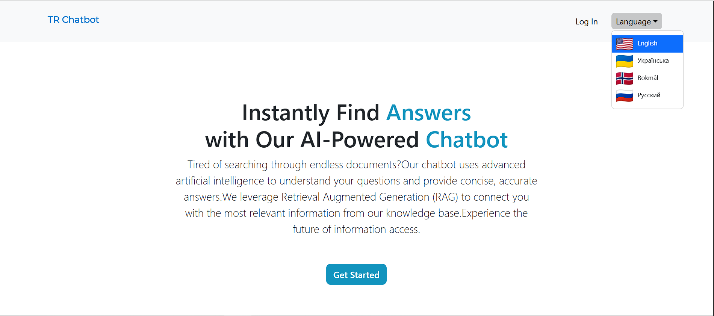

# TR-ChatBot



TR-ChatBot is an [RAG](https://en.wikipedia.org/wiki/Retrieval-augmented_generation)-based project that leverages a managed knowledge database to deliver contextually relevant responses to user prompts.

## How does it work?
The application operates with two distinct user roles:

- Admins (or Employees): Upload and manage new knowledge in the database.
- Visitors: Engage in conversations with a large language model (LLM), which retrieves relevant context from the database to generate informed responses.

The project uses ```spring-ai-openai-spring-boot-starter``` for both ```ChatClient``` and ```EmbeddingModel```.
```ChatClient``` is powered by ```gpt-3.5-turbo``` model while the ```EmbeddingModel``` uses ```text-embedding-ada-002``` for multilingual support.

## Multilingualism

The application supports the following languages:

- 🇺🇸 United States (English)
- 🇺🇦 Ukraine (Ukrainian)
- 🇷🇺 Russia (Russian)
- 🇳🇴 Norway (Norwegian Bokmål)

TR-ChatBot supports multiple languages, ensuring seamless interactions for users regardless of the language they query in.
Even if the relevant context is stored in a different language within the database,
the system will automatically detect the user's language and generate a response in that language—provided
that it is among the supported languages in the project and there is relevant context available in the database.

There is a ```TranslationService``` as well that will add the translated versions of the context to the db upon an upload if was enabled.
It is also used to detect the language of the uploaded context as well as the language a visitor sends a prompt in.

By default, the project uses ```deepl``` translation api via ```deepl-java``` dependency.
There is also an option for ```libre``` translation service that calls locally hosted [Libre Translator](https://libretranslate.com/).
You can specify the desired ```TranslationService``` via ```translation.provider``` in ```application.properties```.

## Set up
The project runs in Docker. A minimal set up required to start the application is as follows:

- Provide an ```Open AI``` key: replace ```SPRING_AI_OPENAI_API_KEY``` with your own ```Open AI``` key.
- Provide a ```DeepL``` key: replace ```DEEPL_API_KEY``` key with your own ```DeepL``` key. 
Or change the ```translation.provider``` in ```application.properties``` to ```libre``` and run a locally hosted ```Libre Translator```. 

### Optionally:

- Set up mail props: You can also add mail properties at ```SPRING_MAIL_USERNAME``` and ```SPRING_MAIL_PASSWORD```, if you wish to register new users. By default, an application provides 2 users created
upon the 1st startup. These are:
  - Employee: Login ```employee@example.com```, Password: ```12345678```.
  - Visitor: Login ```visitor@example.com```, Password: ```12345678```.

You can change them at ```src/main/resources/data.sql```.

To start the application (from the root of the project):

- `docker-compose build --no-cache`
- `docker-compose up`
- (Optional) Run in detached mode: `docker-compose up -d`
- To stop: `docker-compose down`


